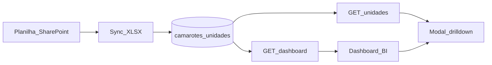

# BI Camarotes — especificação para recriar o dashboard

Documento de portabilidade do dashboard público de Camarotes (`/bi/camarotes`). Serve para recriar a mesma tela e as mesmas agregações em outro projeto.

**Escopo:** layout, KPIs, regras de situação, fórmulas, contratos de API/JSON e mapeamento da planilha-fonte.  
**Fora de escopo:** alertas por e-mail, gatilhos, admin de visualizadores/config (ver [`camarotes-alertas.md`](camarotes-alertas.md) se necessário).

## Visão geral

| Item | Valor |
|------|--------|
| Rota frontend | `/bi/camarotes` |
| Endpoint principal | `GET /api/v1/camarotes/dashboard` |
| Endpoint drilldown | `GET /api/v1/camarotes/unidades` |
| Fonte | Planilha SharePoint (XLSX) sincronizada → tabela `camarotes_unidades` |
| Escopo do dash | Somente `tipo_unidade = 'camarote'` (lounge existe no schema, mas não entra no BI) |
| Autorização (referência) | JWT + viewer de camarotes (ou admin do módulo) |



## Layout da tela (ordem visual)

### 1. Header

- Título: **Camarotes**
- Meta: “Sincronizado com a planilha do SharePoint · atualizado em `{ultima_sync}`”
- Ações (somente quem tem módulo admin `camarotes`):
  - Link “Configurar” → `/admin/camarotes`
  - Botão “Sincronizar agora” → `POST /api/v1/camarotes/sincronizar` + reload do dashboard

### 2. KPIs operacionais (5 cards)

| Card | Cor semântica | Campo | Subtítulo |
|------|---------------|-------|-----------|
| Vence hoje / vencidos | vermelho (`is-red`) | `camarotes.alertas.vencidos` | renovação imediata |
| Vencem em 30 dias | laranja (`is-orange`) | `camarotes.alertas.vence_30d` | renovação urgente |
| Vencem em 90 dias | âmbar (`is-amber`) | `camarotes.alertas.vence_breve` | entre 31 e 90 dias |
| Camarotes vagos | verde (`is-green`) | `camarotes.alertas.vagos` | disponíveis para locação |
| Ocupados | accent (`is-accent`) | `camarotes.alertas.ativos` | `de {total} unidades · {ocupacaoPct}% ocupação` |

Cards com contagem `> 0` são clicáveis e abrem o modal de drilldown.

### 3. Par: Calendário de vencimentos + Receita a renovar

**Calendário de vencimentos** (próximos 12 meses):

- Cap esquerda: `vencimentos.vencidos`
- 12 colunas (barras): `vencimentos.meses[]` com `label`, `qtd`, `venceBreve`
- Cap direita: `vencimentos.apos12m`
- Legenda: meses com vencimento em ~90 dias vs. mais adiante

**Receita a renovar:**

- Total grande: `receitaRenovar.total12m` (receita anual que vence nos próximos 12 meses)
- Barras horizontais por trimestre: `receitaRenovar.trimestres[]`
- Rodapé: `receitaRenovar.vencida` (“Vencida · renovação em aberto”)

### 4. Faixa financeira (5 métricas)

| Label | Campo |
|-------|--------|
| Receita anual | `camarotes.metricas.receita_anual` |
| Ticket médio anual | `camarotes.metricas.ticket_medio_anual` |
| Valor médio contrato | `camarotes.metricas.valor_medio_contrato` |
| Capacidade total | `camarotes.metricas.capacidade_total` |
| Média por unidade | `camarotes.metricas.media_por_unidade` |

Formatação: moeda BRL (`pt-BR`). Capacidade/média como número.

### 5. Par: Pack30 + Vagas VVIP

**Pack30**

- Barra bipartida: `% com Pack30` vs resto
- Contagens: `pack30.com_pack30` / `pack30.sem_pack30`
- Meta: total = soma das duas

**Vagas VVIP**

- `vagas_vvip.total_vagas`
- `vagas_vvip.valor_total` (BRL)

### 6. Par: Disponíveis por setor + Tipo de cessionário

**Disponíveis por setor**

- Setores fixos na UI: `Oeste`, `Norte`, `Leste`, `Sul`
- Por setor: `total` + chips com `numeros[]`
- Barra relativa ao máximo entre setores
- Meta do card: total de vagos (`alertas.vagos`)

**Tipo de cessionário**

- Meta: `metricas.qtd_ativos` contratos ativos
- Tabela: Tipo | Qtd. | Valor total (ordem preferencial: Cessionário → Patrocinador → SEP → Outros)
- Cores: Cessionário=brand, Patrocinador=warn, SEP=green, Outros=dim
- Bloco “Por andar”: tags `{tipo} {qtd}` por andar

### 7. Modal de drilldown

Quatro modos de tabela:

| Modo | Colunas |
|------|---------|
| `vago` | Número, Setor, Andar, Capacidade |
| `contrato` | Número, Setor, Andar, Cessionário, Tipo, Início, Término, Dias p/ vencer, Valor anual |
| `pack30` | Número, Setor, Cessionário, Pack30 (Sim/Não) |
| `vvip` | Número, Setor, Cessionário, Vagas VVIP, Valor vagas |

Rodapé: Exportar PDF + Fechar. Ordenação da lista: setor → número (numérico, `pt-BR`).

---

## Modelo da unidade

### Tabela `camarotes_unidades` (campos relevantes ao BI)

| Coluna | Tipo | Uso no dash |
|--------|------|-------------|
| `id` | INT PK | identidade no drilldown |
| `tipo_unidade` | ENUM(`camarote`,`lounge`) | filtro = `camarote` |
| `andar` | VARCHAR(20) | breakdown / modal |
| `setor` | VARCHAR(20) | vagos por setor |
| `numero` | VARCHAR(20) | chave visual / UNIQUE com tipo |
| `capacidade` | INT | métricas + modal vago |
| `cessionario` | VARCHAR(255) | vago vs ocupado; breakdowns |
| `tipo_cessionario` | VARCHAR(40) | tabela de tipos |
| `primeira_locacao` | DATE | (persistido; pouco usado no BI) |
| `inicio_locacao` | DATE | modal contrato |
| `final_locacao` | DATE | situação, calendário, receita |
| `valor_total` | DECIMAL(14,2) | valor médio contrato / tipos |
| `valor_anual` | DECIMAL(14,2) | receita / ticket / renovar |
| `valor_vagas` | DECIMAL(14,2) | VVIP |
| `vagas_vvip` | INT | VVIP |
| `pack30` | TINYINT(1) | Pack30 |
| `status_contrato` | VARCHAR(60) | (persistido; não no BI principal) |

Campos derivados na API (não são colunas):

| Campo | Origem |
|-------|--------|
| `situacao` | expressão SQL / regra de negócio |
| `dias_restantes` | `final_locacao − hoje` (dias inteiros) |

### Interface TypeScript (resumo)

```ts
type TipoUnidade = 'camarote' | 'lounge';
type SituacaoUnidade = 'vago' | 'vencido' | 'vence_breve' | 'ativo';

interface CamaroteUnidade {
  id: number;
  tipo_unidade: TipoUnidade;
  andar: string | null;
  setor: string | null;
  numero: string;
  capacidade: number | null;
  cessionario: string | null;
  tipo_cessionario: string | null;
  primeira_locacao: string | null; // YYYY-MM-DD
  inicio_locacao: string | null;
  final_locacao: string | null;
  dias_restantes?: number | null;
  valor_anual: number | null;
  valor_total: number | null;
  pack30: boolean;
  vagas_vvip: number | null;
  valor_vagas: number | null;
  situacao: SituacaoUnidade;
}
```

---

## Regras de negócio

### Constantes

| Constante | Valor | Onde |
|-----------|-------|------|
| `DIAS_VENCIMENTO_URGENTE` | `30` | backend (fixos) |
| `dias_vence_breve` | config, default `90` | `camarotes_config` |
| Setores UI | `Oeste`, `Norte`, `Leste`, `Sul` | frontend |
| Tipos normalizados | `Cessionário`, `Patrocinador`, `SEP`, `Outros` | backend + frontend |

### Cessionário vago

Uma unidade é **vaga** se `cessionario` (trim, case-insensitive) for:

- vazio / null
- exatamente `VAGO`, `VAGA` ou `-`
- começa com `VAGO ` / `VAGO(` / `VAGO -`

Na sync, valores vagos são gravados como `NULL`.

### `dias_restantes`

Diferença em dias (UTC, meia-noite) entre `final_locacao` e a data de hoje.  
Negativo = já vencido; `0` = vence hoje; `null` se sem data válida.

### Situação SQL (`situacao`)

Usada em filtros `?situacao=` e no campo da unidade:

```
SE cessionario vago          → 'vago'
SENÃO SE final_locacao NULL  → 'ativo'
SENÃO SE final_locacao < hoje → 'vencido'
SENÃO SE final_locacao <= hoje + dias_vence_breve → 'vence_breve'
SENÃO → 'ativo'
```

**Atenção:** em SQL, `vence_breve` cobre **1–90 dias** (ou o valor de config). O card “Vencem em 30 dias” **não** usa `situacao`; usa faixa de `dias_restantes`.

### Buckets dos KPI cards (`resumoAlertas`)

Sobre unidades `tipo_unidade = camarote`, em ordem:

1. Se vago → `vagos++`
2. Se sem `final_locacao`: com cessionário → `sem_data++`; senão → `ativos++`
3. Senão, por `dias_restantes`:
   - `<= 0` → `vencidos`
   - `1..30` → `vence_30d`
   - `31..90` → `vence_breve` *(faixa hardcoded 90 no resumo, independente da config para o split 30/90)*
   - `> 90` → `ativos`

`sem_data` existe no payload mas **não** tem card próprio no BI.

### Totais derivados na UI

```
totalUnidades = ativos + vagos + vencidos + vence_30d + vence_breve
ocupacaoPct   = round(ativos / totalUnidades * 100)   // 0 se total=0
```

### Tipo de cessionário (normalização)

Match case-insensitive por substring:

| Contém | Tipo |
|--------|------|
| `patroc` | Patrocinador |
| `sep` | SEP |
| `cess` | Cessionário |
| (resto / vazio) | Outros |

### “Tem cessionário” (filtros de drilldown no frontend)

Verdadeiro se `cessionario` trimado não for vazio, `-`, `vago` nem `—`.

---

## Contrato da API

Base: `/api/v1/camarotes` (JWT).

### `GET /dashboard`

Resposta: `CamarotesDashboard`.

```json
{
  "ultima_sync": "2026-08-02T12:00:00.000Z",
  "dias_vence_breve": 90,
  "dias_vencimento_urgente": 30,
  "camarotes": {
    "disponiveis_por_setor": {
      "Oeste": { "numeros": ["101", "102"], "total": 2 },
      "Norte": { "numeros": [], "total": 0 },
      "Leste": { "numeros": ["210"], "total": 1 },
      "Sul": { "numeros": [], "total": 0 }
    },
    "alertas": {
      "vencidos": 3,
      "vence_30d": 5,
      "vence_breve": 8,
      "vagos": 12,
      "ativos": 40,
      "sem_data": 0
    },
    "metricas": {
      "receita_anual": 12500000.0,
      "ticket_medio_anual": 312500.0,
      "valor_medio_contrato": 950000.0,
      "capacidade_total": 800,
      "media_por_unidade": 20.0,
      "qtd_ativos": 40
    },
    "tipo_cessionario": {
      "resumo": {
        "Cessionário": { "quantidade": 20, "valor_total": 10000000.0 },
        "Patrocinador": { "quantidade": 10, "valor_total": 4000000.0 },
        "SEP": { "quantidade": 5, "valor_total": 1500000.0 },
        "Outros": { "quantidade": 2, "valor_total": 200000.0 }
      },
      "por_andar": {
        "1": { "Cessionário": 5, "Patrocinador": 2 },
        "2": { "SEP": 3 }
      }
    },
    "pack30": { "com_pack30": 15, "sem_pack30": 22 },
    "vagas_vvip": { "total_vagas": 48, "valor_total": 240000.0 }
  },
  "vencimentos": {
    "vencidos": 3,
    "apos12m": 10,
    "refHoje": "2026-08-02",
    "refLimite12m": "2027-08-02",
    "meses": [
      { "ym": "2026-08", "label": "ago", "qtd": 2, "venceBreve": true },
      { "ym": "2026-09", "label": "set", "qtd": 1, "venceBreve": true },
      { "ym": "2026-10", "label": "out", "qtd": 0, "venceBreve": false }
    ]
  },
  "receitaRenovar": {
    "total12m": 3500000.0,
    "vencida": 800000.0,
    "trimestres": [
      { "label": "3T/26", "ano": 2026, "tri": 3, "valor": 1200000.0 },
      { "label": "4T/26", "ano": 2026, "tri": 4, "valor": 900000.0 }
    ]
  }
}
```

Notas:

- `vencimentos.meses` sempre tem **12 entradas** (mês atual + 11), mesmo com `qtd = 0`.
- `venceBreve` no mês: `"{ym}-01" <= limite_breve` onde `limite_breve = hoje + dias_vence_breve`.
- Backend valida `vencimentos.vencidos === alertas.vencidos`; inconsistência gera erro 500.
- Labels de mês: `jan fev mar abr mai jun jul ago set out nov dez`.
- Label de trimestre: `{tri}T/{ano % 100}` com 2 dígitos (ex.: `3T/26`).

### `GET /unidades`

Query params opcionais:

| Param | Tipo | Efeito |
|-------|------|--------|
| `tipo` | `camarote` \| `lounge` | filtra tipo |
| `setor` | string | filtra setor |
| `situacao` | `vago` \| `vencido` \| `vence_breve` \| `ativo` | situação SQL |
| `dias_restantes_min` | number | `DATEDIFF(final, CURDATE()) >= min` |
| `dias_restantes_max` | number | `DATEDIFF(final, CURDATE()) <= max` |

Resposta: `CamaroteUnidade[]`.

Alguns drilldowns ainda aplicam **filtro client-side** após o fetch (Pack30, tipo, andar, receita, etc.).

### Mapa clique UI → fetch / filtro

| Clique | Modo modal | Fetch | Filtro extra (client) |
|--------|------------|-------|------------------------|
| KPI vencidos | `contrato` | `tipo=camarote`, `dias_restantes_max=0` | — |
| KPI 30 dias | `contrato` | `tipo=camarote`, `dias_restantes_min=1`, `max=30` | — |
| KPI 90 dias | `contrato` | `tipo=camarote`, `dias_restantes_min=31`, `max=90` | — |
| KPI vagos | `vago` | `tipo=camarote`, `situacao=vago` | — |
| KPI ocupados | `contrato` | `tipo=camarote`, `situacao=ativo` | — |
| Pack30 com/sem | `pack30` | `tipo=camarote` | tem cessionário e `pack30 === bool` |
| Vagas VVIP | `vvip` | `tipo=camarote` | `vagas_vvip > 0` |
| Setor X | `vago` | `tipo=camarote`, `setor=X`, `situacao=vago` | — |
| Todos vagos | `vago` | `tipo=camarote`, `situacao=vago` | — |
| Tipo cessionário | `contrato` | `tipo=camarote` | tem cessionário e tipo normalizado = nome |
| Andar + tipo | `contrato` | `tipo=camarote` | tem cessionário + andar + tipo |
| Timeline vencidos | `contrato` | (igual KPI vencidos) | — |
| Mês `ym` | `contrato` | `tipo=camarote` | tem cessionário e `final_locacao` começa com `ym` |
| Após 12m | `contrato` | `tipo=camarote` | tem cessionário e `final_locacao >= refLimite12m` |
| Receita total 12m | `contrato` | `tipo=camarote` | tem cessionário, `valor_anual > 0`, `refHoje <= final < refLimite12m` |
| Trimestre receita | `contrato` | `tipo=camarote` | idem + `final` no intervalo do trimestre |
| Receita vencida | `contrato` | `tipo=camarote` | tem cessionário, `valor_anual > 0`, `final < refHoje` |

---

## Fórmulas por bloco

Predicado comum **OCUPADO** = cessionário não vago.

### Alertas / KPIs

Ver seção “Buckets dos KPI cards”.

### Métricas financeiras

Universo: `tipo = camarote` **e** `situacao === 'ativo'` **e** tem `cessionario`.

```
receita_anual         = Σ valor_anual
ticket_medio_anual    = receita_anual / qtd          (0 se qtd=0)
valor_medio_contrato  = (Σ valor_total) / qtd
capacidade_total      = Σ capacidade
media_por_unidade     = capacidade_total / qtd       (1 casa decimal)
qtd_ativos            = qtd
```

Valores monetários arredondados a 2 casas.

### Pack30

Universo: camarotes com cessionário (qualquer situação não-vaga por cessionário).

```
com_pack30 = count(pack30 === true)
sem_pack30 = count(pack30 === false)
```

UI: `pack30PctCom = round(com / (com+sem) * 100)`.

### Vagas VVIP

Mesmo universo (com cessionário):

```
total_vagas = Σ vagas_vvip
valor_total = Σ valor_vagas
```

### Disponíveis por setor

Universo: `situacao === 'vago'`. Agrupa por setor (match case-insensitive com os 4 nomes fixos). Ordena números com locale `pt-BR` numérico.

### Tipo de cessionário

Universo: camarotes com cessionário.

- `resumo[tipo].quantidade` / `.valor_total` (usa tipo **normalizado**; `valor_total` da unidade)
- `por_andar[andar][tipo_raw]`: conta por andar (`andar` ou `"Sem andar"`) usando o texto **cru** de `tipo_cessionario` (ou `"Outros"`)

### Calendário de vencimentos

Universo SQL: ocupados, `final_locacao` não nulo.

| Métrica | Condição |
|---------|----------|
| `vencidos` | `final_locacao <= CURDATE()` |
| `meses[i].qtd` | `CURDATE() <= final < CURDATE()+12 months`, agrupado por `YYYY-MM` |
| `apos12m` | `final_locacao >= CURDATE()+12 months` |
| `refHoje` | `CURDATE()` ISO |
| `refLimite12m` | `CURDATE()+12 months` ISO |

### Receita a renovar

Universo: ocupados, `valor_anual` e `final_locacao` não nulos.

| Métrica | Condição | Valor |
|---------|----------|-------|
| `total12m` | `hoje <= final < hoje+12m` | Σ `valor_anual` |
| `vencida` | `final < hoje` | Σ `valor_anual` |
| `trimestres` | mesmo intervalo de 12m | Σ por `YEAR` + `QUARTER`; só entra se valor > 0 |

---

## Origem dos dados (planilha XLSX)

Sync lê a aba configurada (default `Camarotes`) e mapeia cabeçalhos normalizados (trim, lower, sem acento, espaços colapsados).

### Campos obrigatórios no header

- `numero` (aliases: numero, número, numero.)
- `final_locacao` (aliases: final locação, final locacao)

Linhas sem número (ou número `-`) são ignoradas. Sync substitui o conjunto de unidades do tipo.

### Mapa de colunas

| Campo interno | Aliases aceitos no header |
|---------------|---------------------------|
| `andar` | andar |
| `setor` | setor |
| `numero` | numero, número, numero. |
| `capacidade` | capacidade do camarote, capacidade |
| `cessionario` | cessionário, cessionario |
| `tipo_cessionario` | tipo (cessionário/patrocinador/sep), tipo (cessionario/patrocinador/sep), tipo |
| `primeira_locacao` | primeira locação, primeira locacao |
| `inicio_locacao` | início locação/renovação, inicio locacao/renovacao, início locação, inicio locacao |
| `final_locacao` | final locação, final locacao |
| `tempo_anos` | tempo de contrato (anos), tempo contrato anos, anos |
| `tempo_meses` | tempo de contrato (meses), tempo contrato meses, meses |
| `valor_total` | valor total, r$ valor total |
| `valor_cessao` | valor cessão, valor cessao, r$ valor cessão |
| `valor_anual` | valor anual, receita anual, r$ valor anual |
| `entrada` | entrada, r$ entrada |
| `valor_parcelado` | valor parcelado, r$ valor parcelado |
| `valor_vagas` | valor das vagas, valor vagas, r$ valor vagas, r$ valor das vagas, valor vvip |
| `qtd_parcelas` | qtd. parcelas, qtd parcelas, quantidade parcelas |
| `vagas_vvip` | vagas vvip, vaga vvip |
| `credencial_staff` | credencial staff, credencial |
| `categorias_staff` | categorias staff, categoria staff |
| `pack30` | pack30 2026, pack30 |
| `status_contrato` | status contrato, status do contrato |

### Parsers

| Tipo | Regra |
|------|--------|
| Moeda pt-BR | remove `R$`, remove milhar `.`, vírgula → ponto; ou number Excel |
| Data | Date JS, serial Excel, `dd/mm/yyyy`, ou `yyyy-mm-dd` → `YYYY-MM-DD` |
| Sim/Não (`pack30`) | `sim|s|yes|1|true|x` → 1; resto → 0 |
| Cessionário | se vago → `null`; senão string trimada |
| Inteiro | dígitos / trunc number |

---

## Formatação na UI

| Caso | Formato |
|------|---------|
| Moeda | `toLocaleString('pt-BR', { style: 'currency', currency: 'BRL' })` |
| Moeda compacta (≥ 1 mi) | `R$ X,X mi` |
| Moeda compacta (≥ 1 mil) | `R$ X,X mil` |
| Dias restantes | `N dias` / `1 dia` / `Vence hoje` / `Vencido há N dia(s)` |
| Andar | util de formatação de label (ex. número → “Nº andar”) |
| Data modal | `dd/MM/yyyy` |

Altura/largura de barras: relativas ao máximo do conjunto (mínimo visual ~8% nas barras do calendário quando `qtd > 0`).

---

## Checklist de recriação

1. **Schema** — tabela de unidades com os campos da seção “Modelo”.
2. **Ingestão** — parser XLSX com o `HEADER_MAP` e parsers de moeda/data/sim-não; upsert/replace por sync.
3. **Regras** — funções `isCessionarioVago`, `diasRestantes`, buckets de alerta (30/90), normalização de tipo.
4. **Endpoint agregador** — montar o JSON `CamarotesDashboard` com as fórmulas acima (alertas, métricas, pack30, vvip, setores, tipos, vencimentos, receita).
5. **Endpoint lista** — filtros por tipo/setor/situação/`dias_restantes_*` para o modal.
6. **UI** — layout na ordem descrita; cards clicáveis; formatação BRL/`pt-BR`.
7. **Drilldown** — 4 modos de tabela + filtros client-side da tabela de cliques.
8. **Sanidade** — garantir `vencimentos.vencidos === alertas.vencidos`; sempre emitir 12 meses no calendário.

## Referências no repositório original

| Peça | Caminho |
|------|---------|
| Página BI | `frontend/src/app/pages/bi/camarotes/` |
| Dashboard UI | `frontend/src/app/shared/camarotes/camarotes-dashboard.component.*` |
| Modal KPI | `frontend/src/app/shared/camarotes/camarotes-kpi-modal.component.*` |
| Modelos TS | `frontend/src/app/models/camarote.model.ts` |
| Service HTTP | `frontend/src/app/services/camarotes.service.ts` |
| Rotas API | `backend/src/routes/camarotes.routes.js` |
| Agregações | `backend/src/repositories/camarotes.repository.js` (`buildDashboard`) |
| Situação | `backend/src/utils/camarotes-situacao.util.js` |
| Vago | `backend/src/utils/camarotes-cessionario.util.js` |
| Mapper XLSX | `backend/src/services/camarotes-xlsx.mapper.js` |
| Migration | `backend/src/db/migrations/015_camarotes.sql` |
